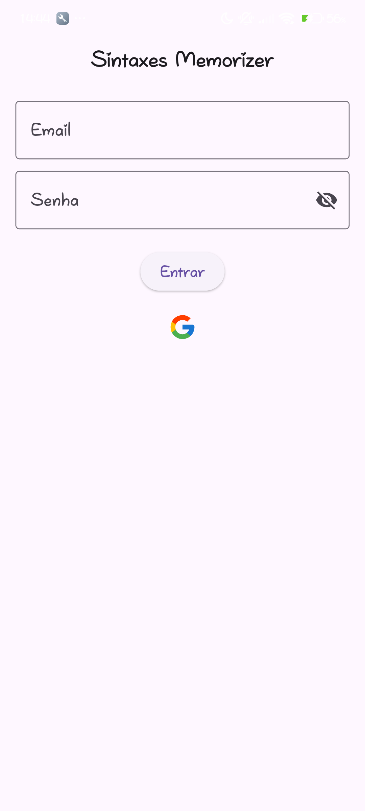
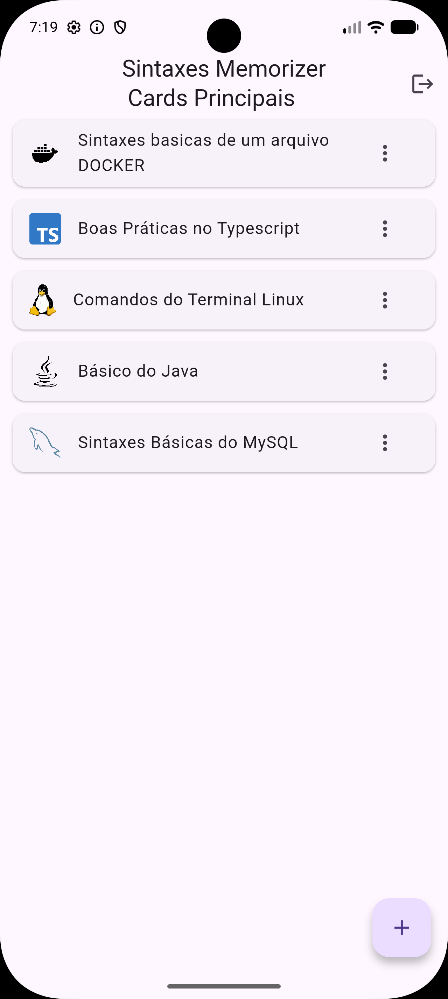
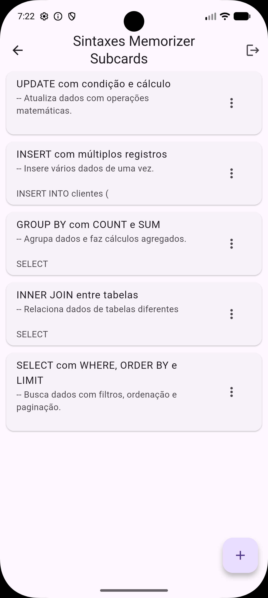
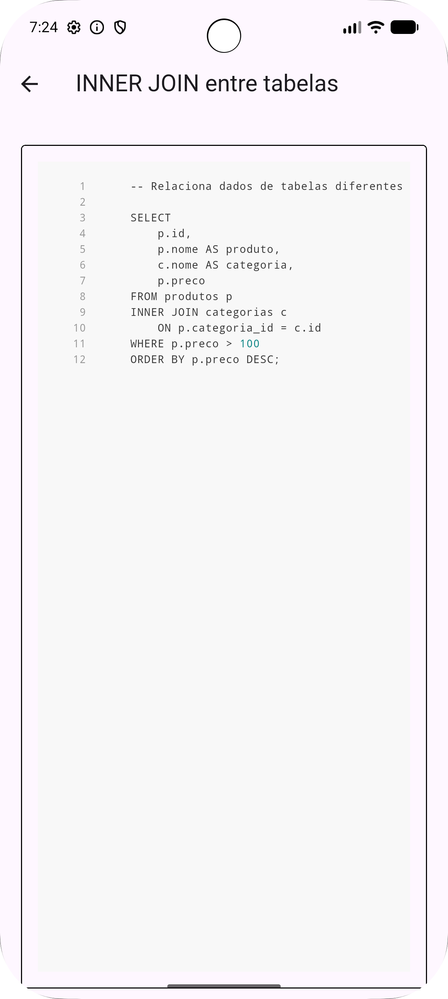

# Sintaxis Memorizer

Aplicação mobile desenvolvida em Flutter para armazenar, organizar e consultar snippets de código, sintaxes e anotações técnicas de forma estruturada.

O projeto utiliza Firebase Authentication para autenticação com Google e Cloud Firestore como banco de dados em tempo real.

---

# Objetivo do Projeto

O objetivo do Sintaxis Memorizer é funcionar como uma biblioteca pessoal de sintaxes e snippets técnicos.

A aplicação permite:

- Criar categorias de estudo.
- Organizar snippets por tecnologia.
- Visualizar código formatado.
- Persistir os dados na nuvem.
- Acessar os dados em tempo real.
- Autenticar usuários via Google.

O foco principal do projeto é produtividade para estudantes e desenvolvedores.

---

# Tecnologias Utilizadas

## Framework

- Flutter
- Dart

## Backend / Cloud

- Firebase Authentication
- Cloud Firestore
- Firebase Core

## Bibliotecas Flutter

- `firebase_auth`
- `cloud_firestore`
- `firebase_core`
- `google_sign_in`
- `flutter_svg`
- `flutter_animate`
- `flutter_code_editor`
- `flutter_highlight`
- `highlight`

---

# Funcionalidades

## Autenticação

- Login com conta Google.
- Persistência automática de sessão.
- Logout do usuário.
- Controle de autenticação via `StreamBuilder`.

## Gerenciamento de Categorias

- Criar categorias principais.
- Selecionar ícones personalizados.
- Editar categorias.
- Excluir categorias.
- Ordenação por data de criação.

## Gerenciamento de Sintaxes

- Criar subcards de sintaxe.
- Editar snippets.
- Excluir snippets.
- Armazenar título e conteúdo.

## Visualização de Código

- Renderização de código com syntax highlight.
- Tema visual baseado no GitHub.
- Exibição em modo leitura.
- Estrutura preparada para múltiplas linguagens.

## Persistência em Nuvem

- Armazenamento em tempo real no Firestore.
- Dados separados por usuário autenticado.
- Estrutura hierárquica organizada.

---

# Estrutura do Projeto

```bash
lib/
│
├── auth/
│   ├── authGate.dart
│   └── authServiceGoogle.dart
│
├── ideiasRandom/
│   ├── CardsDeCategorias.dart
│   └── card_creation_form.dart
│
├── login_screen/
│   └── login_screen.dart
│
├── primary_screen/
│   └── body_primary_screen.dart
│
├── second_screen/
│   └── body_second_screen.dart
│
├── third_screen/
│   └── sintaxis_body_view.dart
│
├── firebase_options.dart
├── app_icons.dart
└── main.dart
```

---

# Arquitetura da Aplicação

A aplicação segue uma estrutura baseada em separação por telas e responsabilidades.

## Fluxo Principal

```text
Login
  ↓
AuthGate
  ↓
Cards de Categorias
  ↓
Subcards de Sintaxe
  ↓
Visualização do Código
```

---

# Estrutura do Banco de Dados

## Firestore

```text
usuarios/
 └── {uid}/
      └── memorizacoes/
           └── {cardId}/
                ├── titulo
                ├── icon
                ├── createdAt
                │
                └── subcards/
                     └── {subcardId}/
                          ├── titulo
                          ├── sintaxe
                          └── createdAt
```

---

# Funcionamento das Principais Telas

## AuthGate

Arquivo:

```bash
lib/auth/authGate.dart
```

Responsável por:

- Verificar autenticação.
- Redirecionar usuário.
- Controlar estado da sessão.

Se o usuário estiver autenticado:

```dart
return const CardsDeCategorias();
```

Caso contrário:

```dart
return const Login();
```

---

## Login

Arquivo:

```bash
lib/login_screen/login_screen.dart
```

Responsável pelo login com Google.

Fluxo:

1. Usuário seleciona conta Google.
2. Google retorna credenciais.
3. Firebase autentica usuário.
4. Sessão é persistida.

---

## Cards de Categorias

Arquivo:

```bash
lib/ideiasRandom/CardsDeCategorias.dart
```

Responsável pelo CRUD das categorias principais.

Principais recursos:

- Listagem em tempo real.
- Ícones SVG.
- PopupMenu para ações.
- Integração direta com Firestore.

---

## Tela de Sintaxes

Arquivo:

```bash
lib/primary_screen/body_primary_screen.dart
```

Responsável pela listagem dos snippets pertencentes à categoria selecionada.

Recursos:

- Animações com `flutter_animate`.
- CRUD de subcards.
- Navegação para visualização do código.

---

## Cadastro de Sintaxe

Arquivo:

```bash
lib/second_screen/body_second_screen.dart
```

Permite cadastrar:

- Título.
- Conteúdo da sintaxe.

Os dados são enviados para:

```dart
usuarios/{uid}/memorizacoes/{cardId}/subcards
```

---

## Visualização de Código

Arquivo:

```bash
lib/third_screen/sintaxis_body_view.dart
```

Responsável pela renderização do snippet.

Bibliotecas utilizadas:

```dart
flutter_code_editor
flutter_highlight
highlight
```

Recursos:

- Syntax highlighting.
- Código somente leitura.
- Scroll vertical.
- Fonte monoespaçada.

---

# Sistema de Ícones

Arquivo:

```bash
lib/app_icons.dart
```

A aplicação possui suporte para ícones SVG personalizados.

Exemplos:

- Flutter
- Docker
- Kubernetes
- Java
- Kotlin
- Angular
- TypeScript
- Linux
- MongoDB
- MySQL
- Spring Boot

Os ícones ficam centralizados em:

```dart
AppIcons.iconsDisponiveis
```

---

# Configuração do Ambiente

## Pré-requisitos

Instale:

- Flutter SDK
- Android Studio
- VSCode (opcional)
- Firebase CLI
- FlutterFire CLI

---

# Instalação do Projeto

## 1. Clonar o repositório

```bash
git clone <url-do-repositorio>
```

---

## 2. Entrar na pasta

```bash
cd sintaxis_memorizer
```

---

## 3. Instalar dependências

```bash
flutter pub get
```

---

# Configuração Firebase

## Criar projeto Firebase

1. Acesse Firebase Console.
2. Crie um novo projeto.
3. Adicione aplicativo Android/iOS/Web.

---

## Ativar Authentication

Ative:

- Google Authentication

---

## Ativar Firestore

Crie banco em modo:

```text
Production ou Test
```

---

## Configurar FlutterFire

Instale:

```bash
dart pub global activate flutterfire_cli
```

Configure:

```bash
flutterfire configure
```

---

# Executando o Projeto

## Rodar em modo debug

```bash
flutter run
```

---

## Build Android

```bash
flutter build apk
```

---

## Build Release

```bash
flutter build apk --release
```

---

# Dependências Esperadas no pubspec.yaml

```yaml
dependencies:
  flutter:
    sdk: flutter

  firebase_core: ^latest
  firebase_auth: ^latest
  cloud_firestore: ^latest
  google_sign_in: ^latest
  flutter_svg: ^latest
  flutter_animate: ^latest
  flutter_code_editor: ^latest
  flutter_highlight: ^latest
  highlight: ^latest
```

---

# Conceitos Técnicos Aplicados

## Flutter

- StatefulWidget
- StatelessWidget
- Navigator
- FutureBuilder
- StreamBuilder
- Hero Animation
- ListView Builder
- InputDecoration

## Firebase

- FirebaseAuth
- Firestore CRUD
- Streams em tempo real
- Organização por UID

## UI/UX

- Material Design
- Syntax Highlighting
- SVG Rendering
- Animações

---

# Fluxo de Dados

```text
Usuário
   ↓
Flutter UI
   ↓
Firebase Authentication
   ↓
Cloud Firestore
   ↓
Atualização em tempo real
```

---

# Melhorias Futuras

## Funcionalidades

- Pesquisa por snippets.
- Favoritos.
- Tags.
- Compartilhamento.
- Exportação de snippets.
- Offline mode.
- Backup automático.
- Suporte para múltiplas linguagens.
- Editor de código avançado.

## Arquitetura

- Provider / Riverpod.
- Clean Architecture.
- Repository Pattern.
- Injeção de dependência.
- Modularização.
- Testes automatizados.

---

# Pontos Fortes do Projeto

- Estrutura simples.
- Integração real com Firebase.
- Persistência em nuvem.
- UI objetiva.
- Separação por responsabilidades.
- Uso de streams em tempo real.
- Base sólida para evolução.

---

# Possíveis Melhorias Técnicas

## Segurança

- Adicionar regras avançadas no Firestore.
- Validar inputs.
- Melhor tratamento de exceções.

## Performance

- Paginação.
- Cache local.
- Lazy loading.

## Código

- Padronização de nomenclatura.
- Refatoração de widgets.
- Separação de services.
- Criação de models.

---

# Regras Básicas do Firestore

rules_version = '2';

service cloud.firestore {
match /databases/{database}/documents {

    // Usuário autenticado só acessa os próprios dados
    match /usuarios/{userId} {
      allow read, write: if request.auth != null
                          && request.auth.uid == userId;
    }

    
    match /usuarios/{userId}/memorizacoes/{docId} {
      allow read, write: if request.auth != null
                          && request.auth.uid == userId;
    }
     
    match /usuarios/{userId}/memorizacoes/{docId}/subcards/{cardId} {
      allow read, write: if request.auth != null
                          && request.auth.uid == userId;
    }

    // Bloqueia todo o resto
    match /{document=**} {
      allow read, write: if false;
    }
}
}
```

---

# Capturas de Tela


### Tela de Login 
```

```

### Tela dos cards principais
```

```

### Tela dos SubCards
```

```

### Tela de CadeView
```

```

---

# Autor

Luis Henrique Rodrigues de Oliveira

Estudante de Sistemas de Informação - Campus Urutaí.

---

# Licença

Projeto desenvolvido para fins de estudo e aprendizado.

